# MATHPLOT-VQA

## 1. Introduction
### 1.1. Background Related Work

Symbolab is a popular tool that helps people solve math problems step by step. It started as a search engine for math problems and later added features to show all the steps to solve a problem. However, it focuses more on finding answers to equations and functions from graph images.

Our project was inspired by Symbolab's limitations. We noticed that it doesn't explain graphs well, which can be tough for people who struggle with understanding graphs. So, we decided to create a new system called Math Plot VQA. This system lets users ask questions about graphs by inputting both a question and a photo of the graph. It's different from Symbolab because it helps users understand the meaning and context of graphs, not just compute functions and equations.

To enhance our system's capabilities, we integrated the MATCHA model [Paper Summary](https://github.com/SitthiwatDam/MATHPLOT-VQA/blob/main/papers/matcha.md)
 , an enhanced version of the Pix2Struct model [Paper Summary](https://github.com/SitthiwatDam/MATHPLOT-VQA/blob/main/papers/pixel2struct.md) . MATCHA combines math reasoning and chart derendering tasks to improve visual language models' capabilities. This integration allows our system to better understand and respond to questions about graphs, making math more accessible and understandable for everyone, especially those who struggle with graph comprehension.

Additionally, we utilized the ChartQA dataset [Paper Summary](https://github.com/SitthiwatDam/MATHPLOT-VQA/blob/main/papers/chartvqa.md) to fine-tune our QA model. ChartQA focuses on visual and logical reasoning over charts, providing a benchmark for complex reasoning questions related to charts. By leveraging these resources and technologies, we aim to create a system that not only computes solutions but also helps users understand the meaning and context of graphs, ultimately making math easier and more accessible.

### 1.2. Problem and Motivation

In the world of math problem-solving, there's a big issue for people who struggle with understanding graphs. These individuals find it hard to make sense of math problems that include graphs, which makes learning and problem-solving tough. Most Question Answering (QA) systems today focus on answering questions from text, ignoring the needs of those who rely on graphs. Our goal is to change that. We're working on a VQA system that can understand and respond to questions about graphs. By doing this, we hope to make math more accessible and easier to understand for everyone, especially those who find graphs challenging.

Visual Question Answering (VQA) is a complex artificial intelligence challenge that has captured the interest of researchers across various fields, including computer vision, natural language processing, and machine learning. It involves generating natural language answers to questions asked about an image.

Currently, people who face challenges with graphs have limited options when it comes to getting help with math problems. Text-based explanations often fall short in conveying the information effectively, leaving these individuals frustrated and discouraged. By developing a VQA system that can handle graph-based inputs, we aim to provide a more intuitive and accessible way for them to interact with math problems. This approach can not only improve their understanding of mathematical concepts but also boost their confidence in tackling math-related challenges.

### 1.3. Solution

#### 1.3.1. Solution Requirement

##### Graph Image Submission
Users can easily upload mathematical graph images through the system interface, ensuring seamless interaction.

##### Question Input
The system enables users to ask contextually relevant questions about the submitted graph, fostering active engagement.

##### Graph-Related Answer Generation
- **Math Question-solving (from graph):** The model provides the solutions to mathematical problems derived from the graph data, along with step-by-step explanations.
- **Graph Interpretation:** The system offers insightful analysis of graph data, elucidating key trends and relationships to aid user interpretation.

#### 1.3.2. Architecture of Solution
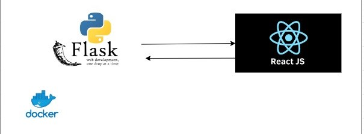
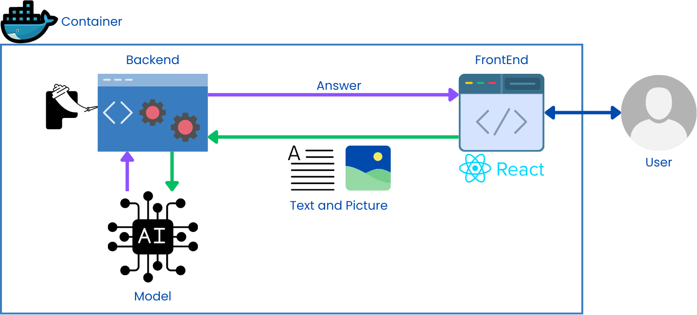

We'll be developing a robust application leveraging Flask as the backend to handle the logic and API endpoints for a model. Flask, with its simplicity and flexibility, will seamlessly integrate with the NLP model, allowing efficient processing of text data. On the frontend, React will provide a dynamic user interface, offering a responsive and intuitive experience for users interacting with the NLP functionalities. By utilizing Docker, I'll encapsulate the entire application, ensuring consistency across different environments and facilitating easy deployment. This combination of Flask, React, and Docker will enable me to build a scalable and efficient solution for NLP-based applications, catering to diverse user needs with ease.

### 1.4. Expected Results

#### User Interaction
**1) Seamless Graph Upload:** Users can effortlessly upload graph images through the system's interface. This should involve functionalities like image selection from device storage.

**2) Contextual Question Input:** The system allows users to ask questions directly related to the uploaded graph. This means the questions should be phrased in a way that considers the graph's structure and properties.

#### System Response
**1) Math Question Solving:** When a user asks a math question that can be solved using the graph data, the system should provide the solution along with a step-by-step explanation. This explanation should be clear and understandable, ideally breaking down the process into logical steps.

**2) Graph Analysis and Interpretation:** The system should analyze the uploaded graph and offer insightful interpretations. This could include identifying key characteristics like the number of nodes and edges, degrees of nodes,  presence of cycles or paths, or highlighting any relevant patterns or trends within the graph structure.

#### Math PlotVQA Demo

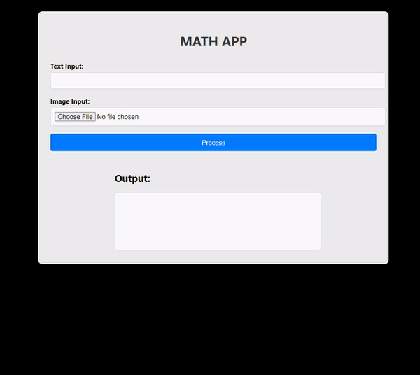

The web application features a text input box where users can type a question, such as "What is this graph about?" Users can also select a graph photo as an image input. After entering both the question and selecting an image, they can click on the "Process" button. The system will then analyze the question and the graph image to provide an answer, making math more accessible and understandable for users.

### 1.5. Contribution

| Name                     | Main Role           |
|--------------------------|---------------------|
| Sitthiwat Damrongpreechar| Application         |
| Pirunrat Kaewphanoaw     | Application         |
| Munthitra Thadthapong    | Slide/ Document     |
| Parun Ngamcharoen        | Model               |
| Nathas Sungworawongpana  | Model               |

### 1.6. Interesting RQ/ Hypothesis/ IV/ DV

## 2. Related Work

### 2.1. A Reinforcement Learning Framework for Natural Question Generation using Bi-discriminators [Link](https://aclanthology.org/C18-1150.pdf),  [Paper Summary](https://github.com/SitthiwatDam/MATHPLOT-VQA/blob/main/papers/Visual%20Question%20Generation%20(VQG).md)

This paper proposes a reinforcement learning framework for generating natural questions about images, known as Visual Question Generation (VQG). The approach focuses on two specific attributes of natural questions: content and linguistic quality. To address this, the authors introduce two discriminators, one for each attribute, inspired by adversarial learning. These discriminators guide the training process by providing scores used as rewards in the reinforcement learning framework. Experimental results on a standard VQG dataset demonstrate the effectiveness and robustness of the proposed model compared to state-of-the-art methods, both through automatic metrics and human evaluation. The paper suggests potential applications of the framework to other language generation tasks, such as dialogue generation with emotional content, and suggests avenues for future research, including improving efficiency in reward assignment and exploring collaborative methods for multiple discriminators.

### 2.2. A reinforcement learning approach for VQA validation: an application to diabetic macular edema grading [Link](https://arxiv.org/pdf/2307.09886.pdf),  [Paper Summary](https://github.com/SitthiwatDam/MATHPLOT-VQA/blob/main/papers/VQA%20validation.md)

This paper addresses the need for better validation methods for highly advanced Visual Question Answering (VQA) algorithms, particularly in the context of medical image analysis, focusing on diabetic macular edema (DME) grading. The authors propose an automatic adaptive questioning approach called Visual Turing Test (VTT) to evaluate the reasoning behavior of VQA algorithms. They introduce a reinforcement learning (RL) agent that observes previous questions and selects the next question to pose, simulating the behavior of a clinician. Through experiments, they demonstrate that this approach generates question streams similar to those of a clinician, effectively evaluating the VQA method's performance. The paper suggests the use of beta distributions to characterize the performance of the VQA system as perceived by the interrogator. The results show that the proposed method can distinguish between reasonable and unreasonable responders, even if their average performance is similar. The authors propose future directions, including applying the framework to other clinical applications, generating more VQA datasets in collaboration with clinicians, and enhancing the representation of images in the questioning process. They also suggest exploring open-ended questions, introducing noise in the state or question, exploiting logical inconsistencies in responses, and integrating the questioning strategy into the training of the VQA model for improved interpretability.

### 2.3. MATCHA: Enhancing Visual Language Pretraining with Math Reasoning and Chart Derendering [Link](https://aclanthology.org/2023.acl-long.714.pdf),  [Paper Summary](https://github.com/SitthiwatDam/MATHPLOT-VQA/blob/main/papers/matcha.md)

MATCHA, a novel pretraining technique for visual language models, integrates math reasoning and chart derendering tasks into the Pix2Struct base model. By incorporating a diverse mixture of pretraining tasks, including math reasoning, chart derendering, and screenshot parsing, MATCHA significantly enhances the model's ability to understand and generate text from visual data. Evaluation across various datasets demonstrates MATCHA's superiority over baselines, including Pix2Struct, with notable improvements in tasks such as ChartQA, PlotQA, and Chart-to-Text summarization. However, limitations include struggles with complex math problems and plot details, suggesting areas for further research and refinement. Despite these limitations, MATCHA's advancements represent a significant step forward in improving the capabilities of visual language models, albeit within a narrow scope of the visual language domain.

### 2.4. GeoQA: A Geometric Question Answering Benchmark Towards Multimodal Numerical Reasoning [Link](https://aclanthology.org/2021.findings-acl.46/), [Paper Summary](https://github.com/SitthiwatDam/MATHPLOT-VQA/blob/main/papers/geoqa.md)

GeoQA presents a benchmark for automatic math problem-solving, focusing on geometric questions that demand understanding of textual descriptions, visual diagrams, and theorem knowledge. To address this challenge, the Neural Geometric Solver (NGS) is introduced, employing a multimodal architecture to parse and generate interpretable programs. NGS integrates a text encoder, diagram encoder, and LSTM decoder with Bahdanau attention, augmented with self-supervised auxiliary tasks to enhance cross-modal semantic representation. Despite significant advancements, results on the GeoQA dataset remain below human performance, underscoring the need for further research in multimodal numerical reasoning.

### 2.5. ChartQA: A Benchmark for Question Answering about Charts with Visual and Logical Reasoning [Link](https://aclanthology.org/2022.findings-acl.177/), [Paper Summary](https://github.com/SitthiwatDam/MATHPLOT-VQA/blob/main/papers/chartvqa.md)

The ChartQA system addresses the need for complex reasoning in data analysis by introducing a large-scale benchmark dataset comprising human-written and generated questions from chart summaries. Unlike existing datasets, ChartQA emphasizes visual and logical reasoning over fixed-vocabulary questions, providing a more comprehensive evaluation framework. VisionTaPas, the proposed solution, employs two transformer-based models to integrate visual features and chart data tables for unified question answering. The models achieve state-of-the-art results on both previous datasets and the newly introduced ChartQA benchmark, underscoring their effectiveness. However, challenges persist in answering complex reasoning questions, particularly in data extraction, highlighting the need for further advancements in deep learning and rule-based methods to mitigate errors.

### 2.6. MMMU: A Massive Multi-discipline Multimodal Understanding and Reasoning Benchmark for Expert AGI [Link](https://arxiv.org/abs/2311.16502), [Paper Summary](https://github.com/SitthiwatDam/MATHPLOT-VQA/blob/main/papers/MMMU.md)

MMMU, a comprehensive benchmark for expert-level multimodal understanding and reasoning, encompasses 11.5K questions across 30 subjects and 6 disciplines, sourced meticulously from college exams, quizzes, and textbooks. It spans a wide array of image types and subfields, aiming to push the boundaries of what large multimodal models (LLMs) can achieve towards Expert AGI. Although not a direct measure of AGI capability, MMMU assesses models' performance akin to tasks faced by experts, highlighting the necessity for next-generation multimodal foundation models. Evaluation of various LLMs, including text-only models with OCR or captioning deployment, reveals GPT-4V achieving the highest accuracy of around 55.7% on the MMMU benchmark. Interestingly, models perform better in disciplines with 'natural' images and less reasoning, such as Art & Design and Humanities & Social Sciences, compared to fields like Science, Health & Medicine, and Technology & Engineering.

### 2.7. MathVista: Evaluating Mathematical Reasoning of Foundation Models in Visual Contexts [Link](https://arxiv.org/abs/2310.02255), [Paper Summary](https://github.com/SitthiwatDam/MATHPLOT-VQA/blob/main/papers/MathVista.md)

MathVista introduces a benchmark for evaluating the mathematical reasoning abilities of large language models (LLMs) and large multimodal models (LMMs) in visually complex scenarios. With a dataset combining challenges from diverse mathematical and visual tasks, including newly created datasets addressing logical, statistical, and scientific reasoning, MathVista evaluates 12 prominent foundation models. GPT-4V emerges as the best performer, achieving the highest accuracy of 49.9%, albeit still falling short of human performance by 10.4%. Augmented LLMs, particularly GPT-4 with program-of-thought prompting, exhibit superior performance over text-only LLMs, while Multimodal Bard shows promise but falls significantly below human performance. Fine-grained analysis highlights GPT-4V's strengths across various tasks and contexts but reveals shortcomings in logical reasoning and numeric common sense tasks. Additionally, qualitative analysis uncovers error sources such as hallucination in Multimodal Bard's predictions, shedding light on areas for improvement in multimodal reasoning models.

### 2.8. Pix2Struct: Screenshot Parsing as Pretraining for Visual Language Understanding [Link](https://doi.org/10.48550/arXiv.2210.03347), [Paper Summary](https://github.com/SitthiwatDam/MATHPLOT-VQA/blob/main/papers/pixel2struct.md)

Pix2Struct presents a novel pretraining approach for visually-situated language understanding models, aiming to address tasks across documents, illustrations, user interfaces (UIs), and natural images. By parsing HTML screenshots into semantic structures, Pix2Struct achieves state-of-the-art results across various benchmarks without relying on domain-specific modifications. The method leverages transformer-based architectures and a large corpus of HTML screenshots for pretraining, demonstrating superior performance compared to prior visual methods. Additionally, the paper discusses challenges in training general-purpose visual language understanding models, such as resolution sensitivity and the need for better data curation, while outlining future research directions to advance the field further. Overall, Pix2Struct lays a strong foundation for enhancing visually-situated language understanding and paves the way for future innovations in this domain.

### 2.9. Visual Instruction Tuning [Link](https://arxiv.org/abs/2304.08485), [Paper Summary](https://github.com/SitthiwatDam/MATHPLOT-VQA/blob/main/papers/Visual%20Instruction%20Tuning.md)

The paper introduces LLaVA, a Large Language and Vision Assistant, designed as an end-to-end trained large multimodal model that integrates vision encoding with language understanding for general-purpose visual and linguistic comprehension. Notably, the study explores leveraging machine-generated instruction-following data to enhance instruction-tuning capabilities in multimodal models. Results indicate that LLaVA exhibits comparable multimodal chat abilities to multimodal GPT-4 on unseen image-instruction pairs, achieving an 85.1% relative score compared to GPT-4 on a synthetic multimodal instruction-following dataset. Furthermore, when fine-tuned on a Science QA task, both LLaVA and GPT-4 achieve a high accuracy of 92.53%, underscoring the effectiveness of incorporating detailed description tasks and complex reasoning tasks in enhancing the conversational capabilities of multimodal models like LLaVA. The architecture of LLaVA integrates a vision encoder (CLIP) to encode images into text, which is then combined with input queries and fed into the language model (Vicuna) to generate textual responses, showcasing the model's versatility and performance across various tasks.

### 2.10. InternVL: Scaling up Vision Foundation Models and Aligning for Generic Visual-Linguistic Tasks [Link](https://arxiv.org/abs/2312.14238), [Paper Summary](https://github.com/SitthiwatDam/MATHPLOT-VQA/blob/main/papers/InternVL.md)

The paper presents InternVL, a large-scale vision-language foundation model designed to address the growing demand for efficient vision-language understanding. Unlike previous vision-language models (VLLMs), InternVL introduces a novel architecture that allows for flexible combinations of vision encoder and middleware for both contrastive and generative tasks. Notably, InternViT-6B, a variant of InternVL, demonstrates the ability to align with language middleware such as QLLaMA and efficiently leverage image-text data from diverse sources for training. Evaluation results indicate that InternVL-Chat outperforms LLaVA-1.5, highlighting its effectiveness in visual-language tasks. Unlike traditional approaches where the vision encoder feeds text directly into the language model, InternVL leverages contrastive learning between the vision encoder and language model for enhanced performance on various visual-language tasks, showcasing its innovative approach in scaling up vision foundation models.

## 3. Methodology

### 3.1. AutoChart

[The AutoChart dataset](https://paperswithcode.com/paper/autochart-a-dataset-for-chart-to-text)
is a valuable resource for training models in the task of chart-to-text generation. It provides a rich collection of chart images paired with corresponding textual descriptions, facilitating models to learn the relationship between visual representations of data and their natural language explanations.

#### 3.1.1.Key Characteristics of AutoChart Dataset:

**I. Focus:** Chart-to-text generation, aiming to generate comprehensive textual descriptions that go beyond simple captions.

**II.Content:**
1) A large collection of chart images encompassing various types (bar, line, scatter, etc.).
2) Textual summaries authored by humans, offering analytical descriptions of the data presented in the charts.
3) The summaries may include insights, trends, and comparisons derived from the charts.
 
**III. Strengths:**

**1) Large Scale:** The extensive dataset size allows models to learn robust patterns and generalize effectively to unseen charts.

**2) Analytical Descriptions:** Rich textual summaries provide more than just captions, promoting model understanding of chart elements, their relationships, and the underlying data insights.

**3) Diverse Charts:** Covering various chart types enhances model capability in handling different data visualizations.
 
**IV. Significance:**
1) AutoChart serves as a crucial benchmark for evaluating the performance of chart-to-text generation models.
2) It fosters the development of models that can generate informative and comprehensive textual descriptions of charts, aiding in data exploration and communication.

#### 3.1.2. Alignment with This Work:
The current work aligns with the focus of the AutoChart dataset by training a model for chart-to-text generation. By leveraging this dataset, the model learns to analyze chart elements, understand the underlying data, and generate textual descriptions that effectively convey the information presented in the charts.

### 3.2. Data Preparation

#### 3.2.1. CustomDataset Class: 
This class is responsible for loading and preprocessing data for the model. It takes the following parameters:

**I. image_paths:** A list of file paths to the chart images.
 
**II.user_prompt:** A string representing the prompt provided to the model (e.g., "What is this chart about?").
 
**III. chart_summaries:** A list of textual summaries corresponding to each image in **image_paths**.
 
**IV. processor:** A text processor object used for handling text data (e.g., tokenization, padding).

#### 3.2.2. get_autochart_urls Function:
This function retrieves image data and corresponding summaries based on chart type. It takes two parameters:

**I. url_list:** A list of dictionaries containing chart URLs and potentially additional information.

**II. chart_type:** A string specifying the chart type (Bar, Line, or Scatter). Defaults to "Bar" if not provided.

**III.** It retrieves image paths by constructing file paths based on the chart type and index within the **url_list**.

**IV.** It extracts chart summaries from the **url_list** dictionaries.

### 3.3. Model and Preprocessing

#### 3.3.1. Pix2StructForConditionalGeneration Model:

**I.** The code employs a pre-trained model **Pix2StructForConditionalGeneration** from the **google/matcha-chart2text-pew** model hub. This model architecture is specifically designed for image-to-text generation tasks.

**II.** It's crucial to choose a pre-trained model that has been trained on a similar task or domain (image-to-text generation) for optimal performance.

#### 3.3.2. Pix2StructProcessor:

**I.** A text processor **Pix2StructProcessor** is loaded from the same model hub. This processor handles text data by performing actions like tokenization, padding, and adding special tokens.

**II.** The processor ensures the text input aligns with the model's expectations.

### 3.4. Training

#### 3.4.1. Training Configuration:

**I.Batch Size (batch_size = 1):**
1) The batch size defines the number of data samples processed by the model during a single training iteration. A batch size of 1 indicates the model is trained on one image-text pair at a time. Smaller batch sizes can lead to more frequent updates and potentially better convergence on complex datasets, but may also be slower to train due to increased overhead.

**II.Number of Epochs (num_epochs = 5):**
1) The number of epochs controls the number of times the entire training dataset is passed through the model. In this case, the model is trained for 5 epochs. The optimal number of epochs depends on the dataset size, model complexity, and learning rate. Training for too few epochs might result in underfitting, while training for too many epochs might lead to overfitting.

**III.Adafactor Optimizer (optimizer = Adafactor(lr=0.01))**
1) The optimizer is an algorithm that updates the model's weights based on the calculated loss during training. Adafactor is a relatively recent optimizer that adapts the learning rate for each parameter individually.
2) The learning rate (lr=0.01) controls how much the model's weights are adjusted in each training step. A higher learning rate can lead to faster convergence but also increase the risk of instability, while a lower learning rate can lead to slower convergence but potentially better generalization.

**IV.Cosine Learning Rate Scheduler (scheduler = get_cosine_schedule_with_warmup)**
1) A learning rate scheduler dynamically adjusts the learning rate throughout training. The code utilizes a cosine learning rate scheduler with warmup.
2) This scheduler starts with a low learning rate, gradually increases it to a peak value, and then decreases it following a cosine curve. The warmup period allows the model to learn initial features before applying the full learning rate.
3) Implementing a learning rate scheduler can help the model converge more effectively and potentially achieve better performance.

#### 3.4.2. Training Loop:
The **train** function plays a pivotal role in the model's training process. It iterates through epochs, performing the following steps within each epoch:

**I.Setting Model to Training Mode (model.train()):**
This ensures the model is prepared for training, enabling operations like dropout and batch normalization that might be deactivated during evaluation.

**II.Iterating Through Data Batches (DataLoader):**
The **DataLoader** shuffles the training data (if shuffle=True) and splits it into batches of a specified size (batch_size). This allows the model to process the data in smaller chunks, improving memory efficiency and potentially accelerating training.

**III. Clearing Optimizer Gradients (optimizer.zero_grad()):** Gradients track how the loss changes with respect to each model parameter (weight or bias). They are used by the optimizer to update the parameters in the direction that minimizes the loss. Clearing gradients before each training step ensures they accumulate only for the current batch, preventing outdated gradients from influencing parameter updates.

**IV. Moving Data to Device (to(device)):**
The code checks if a GPU is available using **torch.cuda.is_available()**. If so, it moves the tensors containing labels, flattened patches (image representations), and attention masks to the GPU using **.to(device)**. Training on a GPU can significantly speed up the process compared to using the CPU.

**V.Forward Pass (outputs = model(...)):** The model takes the processed data (flattened patches and attention masks) along with labels (target text) as input and performs a forward pass through its layers. The forward pass computes the model's predictions and calculates the loss based on the difference between the predictions and the actual labels.

**VI.Calculating Loss (loss = outputs.loss):**
The loss function quantifies the discrepancy between the model's predictions and the ground truth (labels). A lower loss indicates better model performance.

**VII.Backpropagation (loss.backward()):**
Backpropagation propagates the calculated loss backward through the model's layers. This process computes the gradients for each parameter, indicating how much they contributed to the loss.

**VIII.Updating Optimizer Parameters (optimizer.step()):** 
The optimizer utilizes the gradients to update the model's weights and biases in a direction that minimizes the loss. The learning rate (set in the optimizer) determines the magnitude of these updates.

**IX.Updating Learning Rate Scheduler (scheduler.step()):**
After each training step, the learning rate scheduler might adjust the learning rate based on the pre-defined schedule (cosine with warmup in this case). This helps the model converge more effectively and potentially achieve better performance.

### 3.5. Experimental Design

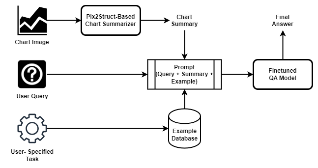

Our proposed solution is a multimodal pipeline in which:
1) User provides a chart image, a query they have about the provided chart, and a task that the model should perform in order to obtain the final result.
2) Chart image is input into a chart summarizer, to obtain a text summary of the input chart. A fine-tuned Pix2Struct model for this task can be downloaded from [here](https://huggingface.co/google/matcha-chart2text-pew).
3) Our system fetches an example from our database that corresponds with the user-specified task. For example, if a user specified that the query requires a task concerning "addition", then our system will fetch a problem-solution pair that involves using addition to find the solution.
4) Concatenate the chart summary, problem-solution example, and user query using a prompt template.
5) Input the concatenated prompt into the QA model to obtain the final answer.

### 3.6. Evaluation

## 4. Result

### 4.1. Progress

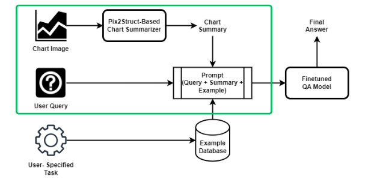
 
[Link to Notebook](https://github.com/SitthiwatDam/MATHPLOT-VQA/tree/main/pretrained%20model)

In Phase 2, our primary goal was to develop a robust model capable of handling graph inputs and user queries, providing accurate and insightful answers. The phase involved the following steps:

1) **Chart Summarizer Models Evaluation:**
We experimented with two chart summarizer models, MatCha-chart2text-pew [Link](https://huggingface.co/google/matcha-chart2text-pew) and MatCha-chart2text-statista [Link](https://huggingface.co/google/matcha-chart2text-statista). The results showed that while the chart summarizer worked well for some graphs (e.g., Example 3), it mostly struggled with others, producing incorrect summaries or grammatical errors (e.g., Examples 1 and 2).

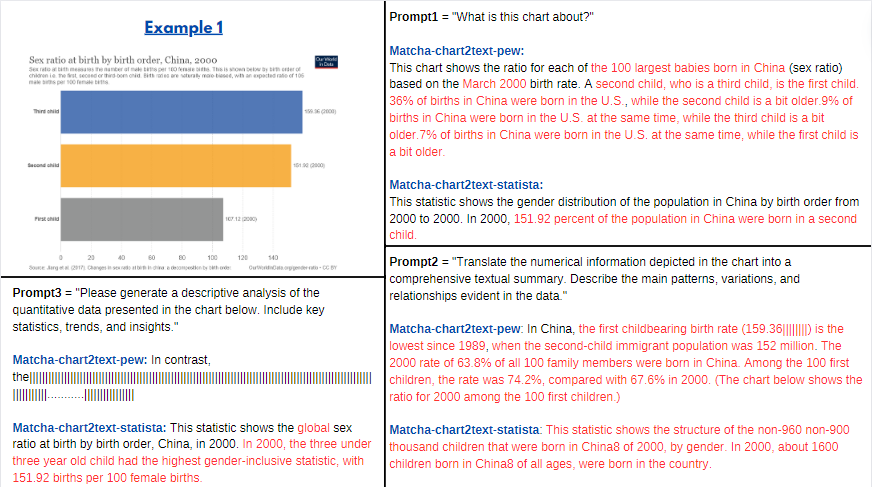

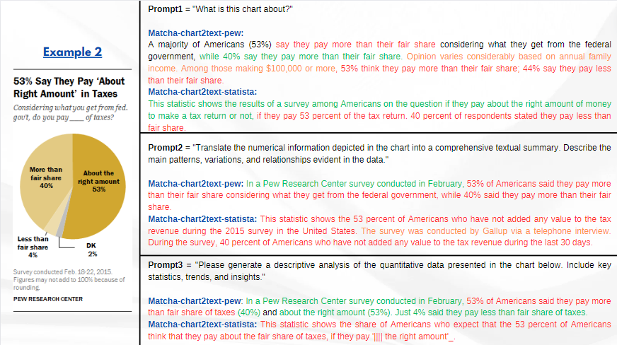

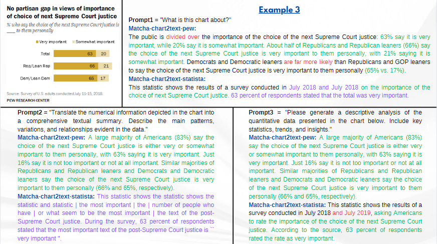

Which;
Red = Wrong Answer,
Orange = Model Generates itself (Hallucination),
Purple = Wording / Grammatical Error,
Green = Correct

2) **Finetuned QA Model**
We combined the chart summary with the user query as a prompt and used the Minichat-3B QA model [Link](https://huggingface.co/GeneZC/MiniChat-3B) to generate answers for question-answering task. The results shows that the errors from the generated answers are highly correlated with those from the summaries generated from the chart summarization step. This is further proven in the case that the generated summary is correct (e.g., Example 3), since the QA model was also able to provide a correct answer with good additional insight to the user query. This indicates that the performance of the QA model is mostly, if not, fully depended on the chart summarizer.

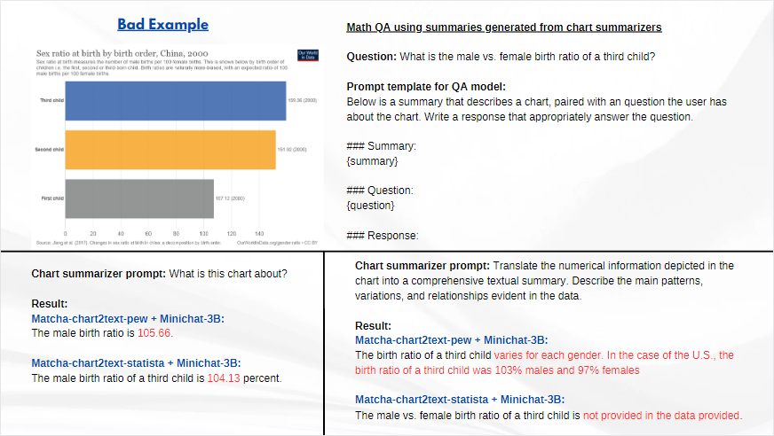

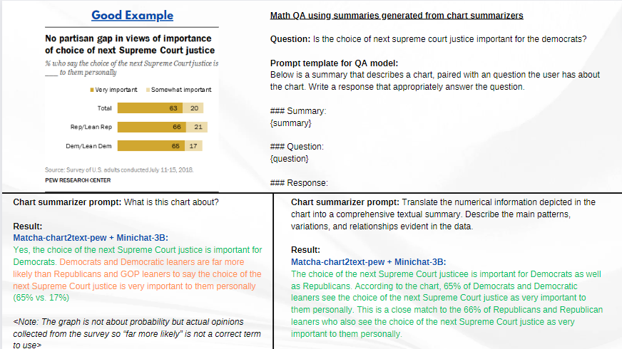

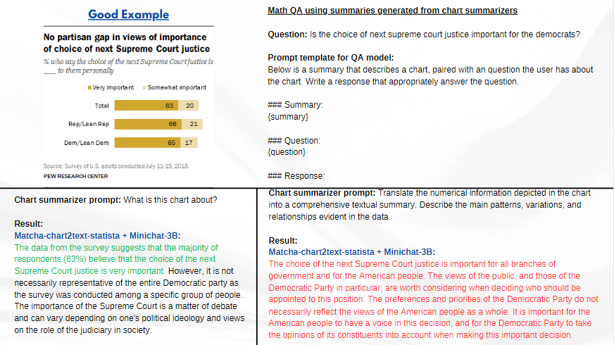

Which;
Red = Wrong Answer,
Orange = Model Generates itself (Hallucination),
Purple = Wording/Grammatical Error,
Green = Correct

### 4.2. Deployment

 This is how the MathPlot VQA Application work. The MathPlot VQA Application allows users to input a question prompt, such as "What is the trend of this graph," and upload a graph picture. After clicking the Process button, the application generates results from a model and displays them in the output box.

## 5. Discussion

### 5.1. Result
### 5.2. Hypothesis
### 5.3. Insights
### 5.4. Limitations

