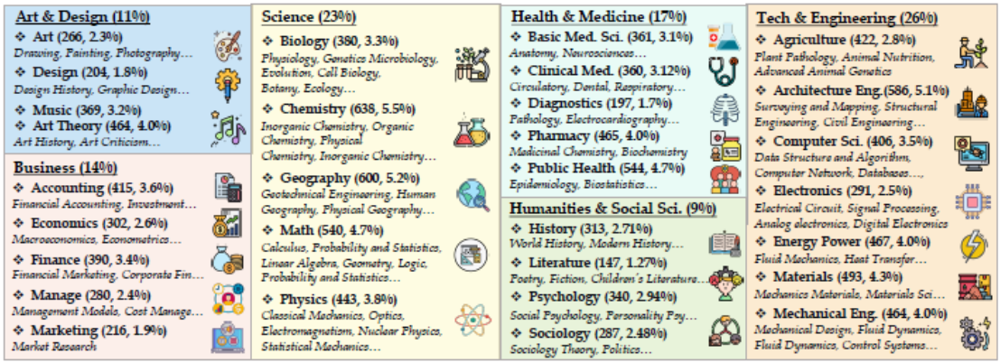
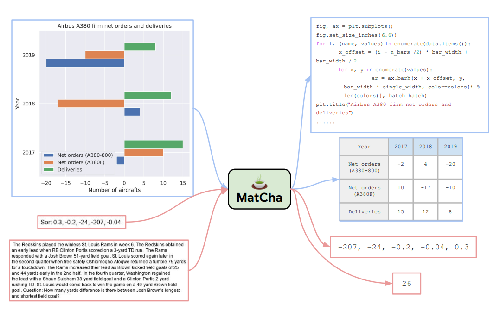

### MMMU: A Massive Multi-discipline Multimodal Understanding and Reasoning Benchmark for Expert AGI

#### Overview:

- Contains 11.5K questions across 30 subjects and 6 disciplines including Art, Business, Health & Medicine, Science, Humanities & Social Science, and Tech & Engineering, and over 183 subfields.
- Questions collected meticulously from college sources like college exams, quizzes, and textbooks  .
- These questions span 30 subjects and 183 subfields, comprising 30 highly heterogeneous image types, such as charts, diagrams, maps, tables, music sheets, and chemical structures.

#### Purpose:

- To push boundaries of LMMs can be achieved  by designing expert-level multimodal understanding and reasoning towards Expert AGI.
- Aims to assess models' performance akin to tasks faced by experts.
- Highlights the need for next-generation multimodal foundation models.
- Although MMMU is not a sufficient test for Expert AGI because here lacks a direct mapping between performance on MMMU and “90th percentile of skilled adults,” nor are college exams the only tasks an AGI shall tackle.
- Compare MMMU between other benchmarks.

#### Results:

- Various large multimodal models evaluated, including Kosmos2, LLaMA-Adapter2, BLIP-2, InstructBLIP, LLaVA-1.5, OpenFlamingo, CogVLM, Fuyu, Qwen-VL, Otter, MiniGPT-4, and mPLUG-Owl2.
- Text-only LLMs considered, such as GPT-4, Llama2-7B, FLAN-T5-XXL, and Vicuna-13B, with OCR or captioning deployment to enhance performance.
- Evaluation metric: micro-averaged accuracy. Rule-based pipelines used for open and multiple-choice question evaluation.
- Robust expressions and workflows applied for accurate answer extraction from long responses.
- Remedial actions for invalid model responses: random selection for multiple-choice, marking incorrect for open questions.
- Baseline models for reference: Random Choice and Frequent Choice.

- GPT-4V achieves highest accuracy around  55.7% on the MMMU benchmark. 
- Models perform better in disciplines with 'natural' images and less reasoning, such as Art & Design and Humanities & Social Sciences, compared to fields like Science, Health & Medicine, and Technology & Engineering
