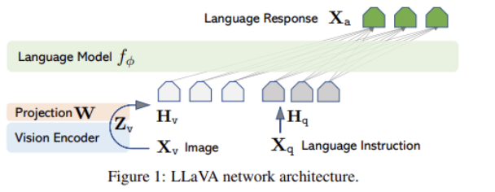

### Visual Instruction Tuning

#### Overview:

- The paper introduced LLaVA: Large Language and Vision Assistant, an end-to-end trained large multimodal model that connects a vision encoder and LLM for general-purpose visual and language understanding. 
- The paper also explores an implementation of machine-generated instruction-following data to improve instruction-tuning on new tasks in a multimodal model.

#### Results:

- LLaVA can demonstrate multimodal chat abilities comparable to multimodal GPT-4 on unseen images/instructions, yielding a 85.1% relative score compared with GPT-4 on a synthetic multimodal instruction-following dataset.
- A fine-tuned LLaVA and GPT-4 on Science QA task can achieve 92.53% accuracy.

#### Key Takeaway:

- Even though the main purpose of LLaVA is to be a chatbot (conversational task), training it through detailed description tasks and complex reasoning tasks also helps boost the performance of conversational tasks.
- The author decided to generate a conversation dataset using GPT-4 for consistency.
- The architecture of LLaVA is composed with a vision encoder (CLIP) to encode an image into a text and create an embedding from the encoded image and the input query to feed it to the language model (Vicuna) to generate texts.

