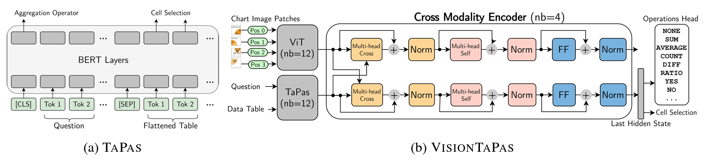
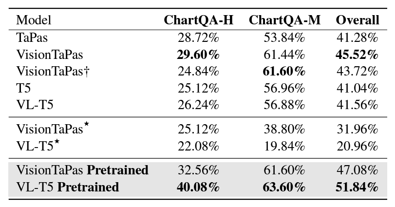

### ChartQA: A Benchmark for Question Answering about Charts with Visual and Logical Reasoning

#### Overview:

- Chart Question Answering (ChartQA) system as an AI data analysis solution.
- Complex reasoning questions arise during chart exploration, involving logical and arithmetic operations.
- Existing datasets lack focus on such complex reasoning, often relying on templates and fixed vocabulary for answers.

#### Dataset Creation:

- Introduction of a large-scale benchmark, ChartQA datasets which comprise of 9.6K human-written questions and 23.1K questions generated from human-written chart summaries.
- Focus on visual and logical reasoning over charts instead of fixed-vocabulary questions which are only useful for classification.

#### Approach:

- VisionTaPas, which consists of two transformer-based models designed to combine visual features and chart data tables for unified question answering.
- The first transformer is a vision transformer (ViT) encoder for encoding the chart images.
- The second transformer is TaPas, a BERT-based encoder that accepts input in both text format and data table format by utilizing an additional positional embeddings for rows and columns.
- A cross-modality encoder accepts outputs from both transformers to compute multimodal encodings which are then passed to the operation head and cell selection to obtain final results.

#### Evaluation and Results:

- Models achieve state-of-the-art results on previous datasets where a gold data table is provided and the newly introduced benchmark using ChartQA datasets.
- Evaluation highlights challenges in answering complex reasoning questions, especially in data extraction where current approaches rely on a combination of deep learning and rule-based methods which are prone to error.