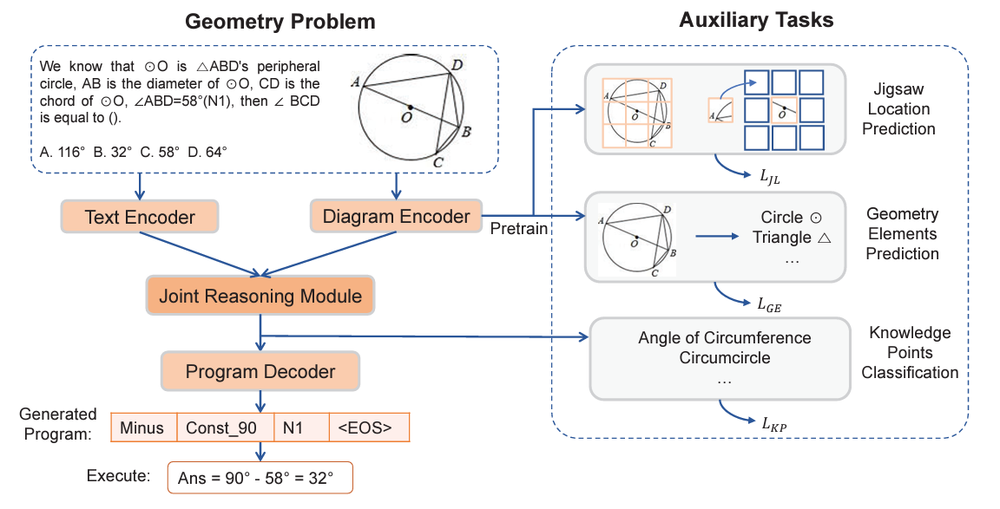

### GeoQA: A Geometric Question Answering Benchmark Towards Multimodal Numerical Reasoning

#### Overview:

- Automatic math problem solving as an AI benchmark.
- Focus on solving geometric problems, requiring understanding of textual descriptions, visual diagrams, and theorem knowledge.
- Existing methods reliant on handcrafted rules, limited evaluation on small datasets.

#### Dataset Creation:

- Introduction of GeoQA dataset containing 5,010 geometric problems with annotated programs in Chinese middle school exam.
- Each problem is annotated by a program where annotated programs serve as a testbed for research on explicit and explainable numerical reasoning.

#### Approach:

- Introduction of Neural Geometric Solver (NGS) to address geometric problems by parsing multimodal information and generating interpretable programs.
- The architecture of NGS consists of a single unidirectional LSTM as text encoder and first three stages of ResNet 101 as diagram encoder.
- The decoder is an LSTM with Bahdanau additive attention.
- Addition of self-supervised auxiliary tasks on NGS to enhance cross-modal semantic representation by separately pretraining the diagram encoder.

#### Evaluation and Results:

- Extensive experiments conducted on GeoQA dataset to validate the effectiveness of NGS and auxiliary tasks.
- Results are still significantly lower than human performance, indicating ample room for future research.