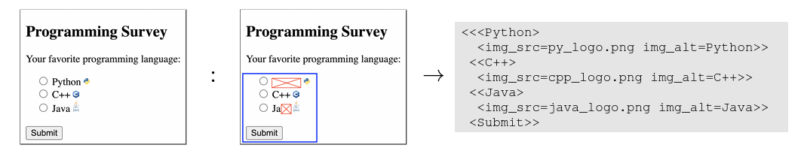
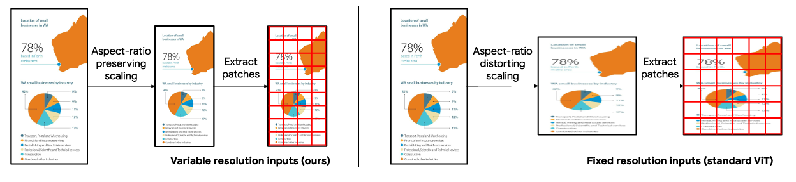
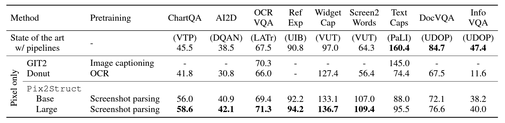

### Pix2Struct: Screenshot Parsing as Pre-training for Visual Language Understanding

#### Introduction:

- Visually-situated language is pervasive, found in textbooks, web pages, mobile apps, etc.
- Previous approaches lack sharing of data, model architectures, and objectives.
- Introducing Pix2Struct, a pretrained image-to-text model for visual language understanding using web page data.
- Leveraging the richness of web data for diverse downstream tasks.

#### Approach:

- Pix2Struct pretrained by learning to parse randomly masked web page screenshots into HTML.
- For fine-tuning, tasks such as common pre-training signals like OCR, language modeling, and image captioning are implemented.
- Introducing flexible integration of language and vision inputs, by rendering prompts like questions directly on input images.

#### Architecture

- Pix2Struct’s architecture is based on ViT, but proposes a modification to input representation for better handling of visually-situated language.
- Unlike standard ViT, it scales input images to maximize fixed-size patches within the sequence length.
- Uses 2D absolute positional embeddings for variable resolutions.
- Enhances robustness to extreme aspect ratios and on-the-fly changes in sequence length and resolution.

#### Evaluation/Results:

- Achieves state-of-the-art results in six out of nine tasks across four domains: documents, illustrations, user interfaces, and natural images.
- Demonstrates the efficacy of a single pretrained model in diverse tasks and domains.
